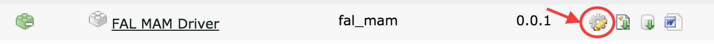

.. ==================================================
.. FOR YOUR INFORMATION
.. --------------------------------------------------
.. -*- coding: utf-8 -*- with BOM.

.. include:: ../Includes.txt

.. _admin-manual:

Installation
------------

1. Install the provided t3x Extenion through the Extension Manager

2. Create a FileStorage using the MAM Driver.

3. Go to the Extension Configuration Page and nter your provided configuration into the extensions configuration page

   **Note: Make sure to set the base_path to the same path the FileStorage was set to in step 2**

4. Go to the Scheduler Module

5. Create a new EventHandler scheduler task and configure it similar to this Screenshot:

**Note: Do not enable Parallel Execution for this Task. Frequency should be below 60 seconds in order to have a quick synchronization cycle.**

6. Create a new EventQueueHandler scheduler task and configure it similar to this Screenshot:

**Notes: You can enable Parallel Execution for this Task, it will fetch/claim events from the queue and can
run in parallel. The Frequency should preferably be below 60 seconds as well in order to have a quick synchronization cycle. Amount of queue items per run should be somewhere around 30-100, but can be tuned for
maximum performance/synchronization speed)**

7. Go into the MAM Dashboard -> Configuration Module to set up mappings of MAM Fields to local sys_file_metadata fields.

8. Set up the Scheduler Cronjob according to https://jweiland.net/typo3/extension/scheduler.html

.. _admin-faq:

FAQ
---

What will happens if referenced file is deleted remove from the export?
^^^^^^^^^^^^^^^^^^^^^^^^^^^^^^^^^^^^^^^^^^^^^^^^^^^^^^^^^^^^^^^^^^^^^^^

The File will be completely removed from the Filesystem and Database. Any non-cached
reference to the file will be removed.

What happens if the MAM API is not reachable/offline/etc?
^^^^^^^^^^^^^^^^^^^^^^^^^^^^^^^^^^^^^^^^^^^^^^^^^^^^^^^^^

The synchronization will fail if the MAM API isn't reachable. But everything up to this
point will be available without a problem.